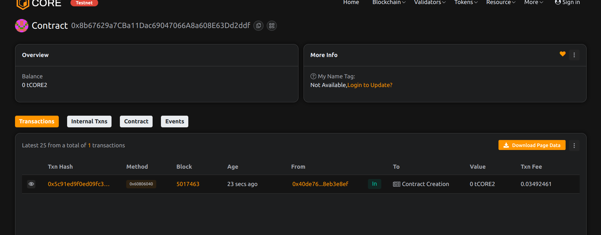

# Project Title: FairFight: Transparent Blockchain Battle Engine 

## Project Description
FairFight is a decentralized battle engine that allows two players to stake funds and engage in a verifiable on-chain duel. An admin or oracle determines the outcome, and the winner claims the pooled stake.

## Project Vision
To ensure trustless, tamper-proof PVP battles across Web3 games, with public results and automated payouts.

## Key Features
- Stake-based PVP battles with transparent outcomes
- Admin-oracle resolution of matches
- Supports win/loss/draw logic
- Automatic winner payout or draw split

## Future Scope
- Integrate VRF (verifiable randomness) for automated resolution
- Use NFTs to represent battle avatars
- DAO-based refereeing and dispute system
- Leaderboard and seasonal rewards on-chain

## Contract Details
0x8b67629a7CBa11Dac69047066A8a608E63Dd2ddf

